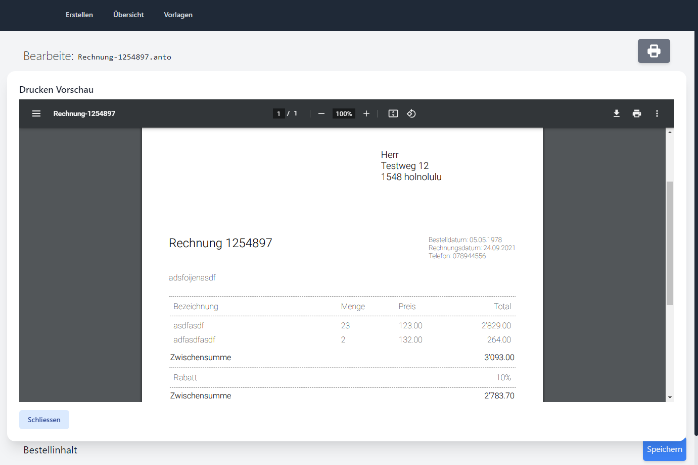

# AI-Invoice
Simple invoice creation tool with pdf export, template, VAT and discount features.



## Download & Install
Go to the newest release and download the installer for your System. Linux, MacOS and Windows are supported.
On Windows auto update is supported.

## Develop
The application is done using Electron and React.
Checkout and run the package installer:
``` 
yarn install
```

Run the application in Dev mode:
``` 
yarn run dev
```

Build the application:
``` 
yarn run make
```

Publish new version:
``` 
npm verison minor | major
git push
```